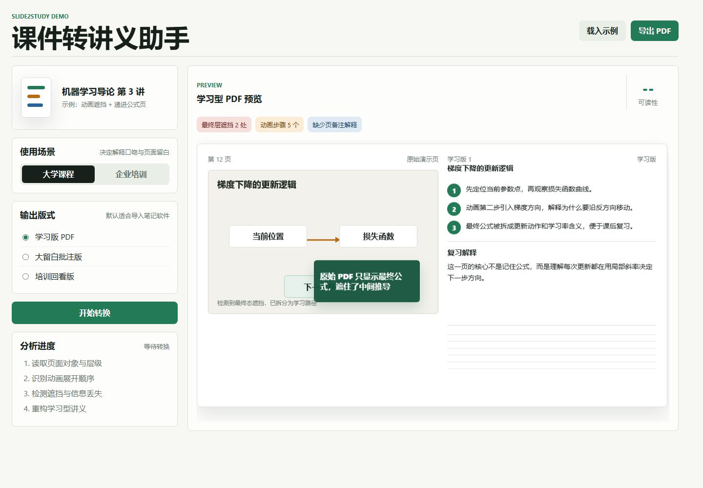

# Slide2Study

把演示型 PPTX 转成更适合学习、复习和理解动画遮挡关系的 PDF。

Slide2Study 不是普通的 PPT 转 PDF 工具。它先用 LibreOffice 生成保真的 `base.pdf`，再分析 PPTX 中的对象、动画、遮挡和媒体关系，输出学习版 `guide.pdf`、对比页和诊断数据，让原本依赖讲师现场讲解的课件更适合离线阅读。



## 核心能力

| 能力 | 说明 |
|---|---|
| 原生保真转换 | 使用 LibreOffice headless 生成 `base.pdf`，保留 PPT 的基础页面效果。 |
| 学习版 PDF | 输出 `guide.pdf`，围绕遮挡、动画顺序、媒体关键帧和局部可读性做增强。 |
| 动画与遮挡分析 | 解析基础动画、对象层级、边界框和拥挤度，生成可审计的 `analysis.json` 与 `augment_plan.json`。 |
| 对比展示 | 生成 `compare.html`，并排展示普通 PDF 与学习版 PDF 的差异。 |
| AI 辅助解释 | 可选接入 OpenAI-compatible 接口，为知识块生成解释，并导出带短旁注的 `ai_guide.pdf`。 |
| 本地优先 | 默认在本机运行，输出写入本地目录，不依赖云端账号体系。 |

## 快速开始

### 1. 准备环境

| 依赖 | 要求 |
|---|---|
| Python | 3.11+，推荐 3.12 |
| LibreOffice | 需要可执行的 `soffice`，用于真实 PPTX 转 PDF |
| Python 包 | `PyMuPDF`、`Pillow` |

Windows 上可以直接安装 LibreOffice，或在运行时通过环境变量指定：

```powershell
$env:SLIDE2STUDY_SOFFICE_PATH="C:\Program Files\LibreOffice\program\soffice.exe"
```

### 2. 安装依赖

```powershell
python -m venv .venv
.\.venv\Scripts\Activate.ps1
python -m pip install -r app\requirements.txt
```

### 3. 启动 Web

```powershell
python .\app\backend\server.py
```

打开：

```text
http://127.0.0.1:8765
```

也可以使用仓库内的启动脚本：

```powershell
powershell -ExecutionPolicy Bypass -File .\start.ps1
```

## 命令行转换

```powershell
python .\app\backend\cli.py .\app\samples\native_conversion_smoke.pptx .\app\workspace\outputs\manual
```

指定 LibreOffice 路径：

```powershell
python .\app\backend\cli.py .\path\to\deck.pptx .\app\workspace\outputs\manual --soffice-path "C:\Program Files\LibreOffice\program\soffice.exe"
```

只生成分析报告和预览，不渲染 PDF：

```powershell
python .\app\backend\cli.py .\path\to\deck.pptx .\app\workspace\outputs\manual --no-pdf
```

## 输出文件

每次转换会生成一个任务目录，Web 默认在 `app/workspace/outputs/<job_id>/`，便携包模式默认在 `data/outputs/<job_id>/`。

| 文件 | 用途 |
|---|---|
| `base.pdf` | LibreOffice 原生转换结果，用于对照。 |
| `guide.pdf` | 学习版 PDF，保留原页面基础并做局部增强。 |
| `compare.html` | 普通 PDF 与学习版 PDF 的对比展示页。 |
| `analysis.json` | PPTX 对象、动画、遮挡、拥挤度分析。 |
| `augment_plan.json` | 学习版 PDF 的增强和重排计划。 |
| `metrics.json` | 耗时、问题数和整理效率估算。 |
| `report.json` | 能力边界、告警和转换问题。 |
| `knowledge_blocks.json` | 页面知识块和 AI 解释输入。 |
| `ai_guide.pdf` | 可选 AI 短旁注学习版 PDF。 |

## 项目结构

```text
app/
  backend/        转换、分析、PDF 增强、AI 解释和本地 HTTP 服务
  frontend/       本地 Web 操作界面
  samples/        可复现的 PPTX 样例
  tests/          单元测试和视觉检查辅助脚本
demo/             早期静态展示 Demo
docs/             技术路线、比赛材料和阶段计划
start.ps1         Windows 一键启动脚本
start.bat         Windows 批处理启动脚本
```

## 样例

| 文件 | 用途 |
|---|---|
| `app/samples/native_conversion_smoke.pptx` | 原生转换冒烟样例。 |
| `app/samples/animation_guide_smoke.pptx` | 基础动画导读样例。 |
| `app/samples/course_animation_occlusion.pptx` | 动画遮挡关系样例。 |
| `app/samples/test.pptx` | 综合回归样例。 |
| `app/samples/Review+chapter24-27.pptx` | 多页课程材料样例。 |

## 测试

```powershell
python -m unittest discover -s app\tests
python -m compileall app\backend
```

前端脚本语法检查：

```powershell
node --check app\frontend\app.js
```

涉及 PDF 视觉输出的改动，不能只看 JSON 或几何指标，应重新转换样例并检查最新 `guide.pdf` 渲染截图。

## 支持边界

| 支持 | 暂不支持 |
|---|---|
| `.pptx` | `.ppt`、Keynote、加密文件 |
| 基础文本、图片、形状、备注读取 | 任意 Office 特效完整还原 |
| appear、fade、wipe、blinds、wheel、明确位置移动等基础动画 | 复杂触发器、交互按钮、任意路径动画 |
| GIF/视频关键关系识别和学习版关键帧表达 | 在 PDF 中保留 GIF/视频播放 |
| 可选 OpenAI-compatible AI 解释 | 无依据扩写或伪造知识点 |

无法可靠处理的页面应保留原生画面并写入报告，不把问题藏起来。

## 开源发布说明


许可证为 [MIT](LICENSE)。

发布维护建议：

| 项 | 建议 |
|---|---|
| Release 包 | 放到 GitHub Releases，不放进源码仓库。 |
| 大型运行时 | LibreOffice 便携包、PyInstaller 产物等放发布附件或构建产物。 |
| 敏感配置 | API Key 只在本地输入或环境变量中使用，不写入仓库。 |
