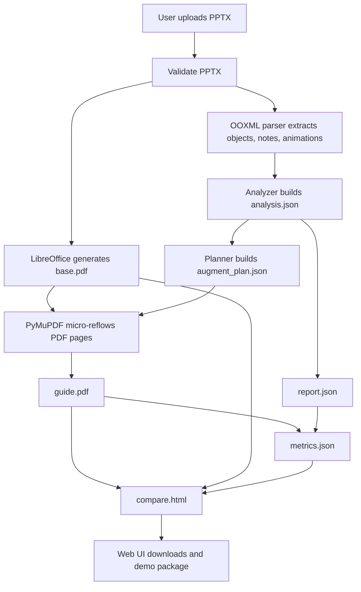

# Final Product Route Implementation Plan

> **For agentic workers:** REQUIRED SUB-SKILL: Use `superpowers:executing-plans` to implement this plan task-by-task. It will decide whether each batch should run in parallel or serial subagent mode and will pass only task-local context to each subagent. Steps use checkbox (`- [ ]`) syntax for tracking.

**Goal:** Finish a competition-ready PPTX-to-learning-PDF tool that runs locally, preserves original PPT visuals, performs PDF-level micro-reflow, explains occlusion/animation flow, and ships with usage docs, a comparison page, and measurable efficiency metrics.

**Architecture:** Keep LibreOffice as the native PPTX-to-PDF renderer. Use PPTX OOXML analysis only for animation/order/bbox diagnosis, then use PyMuPDF to adjust the generated PDF in place. Wrap the pipeline in the existing local Web UI and CLI, then add startup checks, metrics, docs, demo assets, and five self-review optimization rounds.

**Tech Stack:** Python stdlib, LibreOffice headless, PyMuPDF, existing OOXML parser/analyzer, local HTTP server, vanilla frontend.

---

## Confirmed Scope

| Item | Decision |
|---|---|
| Input | First release supports `.pptx` only. |
| PDF library | Use PyMuPDF if needed for reliable PDF micro-reflow. |
| AI API | Do not connect a real model API in the first release; keep a future extension point. |
| Delivery | Ship a runnable local project, usage docs, demo materials, and sample outputs. |
| Autonomy | Once execution starts, continue through implementation, testing, debugging, docs, and five self-review rounds without waiting for new commands unless a destructive or external-account action is needed. |

## Non-Negotiable Direction

| Rule | Meaning |
|---|---|
| Preserve original page | `guide.pdf` must keep the `base.pdf` page as the visual source. |
| No full-page redraw | Do not replace a slide with extracted text/cards. |
| No extra guide pages by default | `guide.pdf` page count equals `base.pdf` unless a page is explicitly marked impossible. |
| Occlusion expansion | Covered content must be visible in a clear alternate position and connected to the covering/follow-up content with sequence numbers, arrows, or relationship lines. Prefer existing blank areas on the original page; use an expansion lane only when blank space is insufficient. |
| Let it crash | Missing LibreOffice/PyMuPDF must produce a clear error, not a fake output. |
| No fabricated content | Explanations and metrics must be derived from runtime data or clearly labeled assumptions. |
| Competition fit | Final deliverable must prove: runs, helps real workflow, has usage docs, shows time/efficiency/error data. |

## Global Flow



## Milestone 1: Route Lock And Cleanup

**Files:**
- Modify: `task_plan.md`
- Modify: `findings.md`
- Modify: `progress.md`
- Modify: `development_roadmap.md`
- Modify: `app/README.md`

- [ ] Remove or mark obsolete all current “full-page redraw / reflow_replace” language.
- [ ] Record final direction as “PDF micro-reflow on top of base.pdf”.
- [ ] Add route guard text: before every implementation batch, check whether output still preserves original page visuals.
- [ ] Verify with:

```powershell
Select-String -LiteralPath task_plan.md, findings.md, progress.md, development_roadmap.md, app\README.md -Pattern '替换式重排','抽取重画','reflow_replace','full-page redraw'
```

Expected: only historical findings or explicit “obsolete” notes remain.

## Milestone 2: PDF Micro-Reflow Core

**Files:**
- Create: `app/backend/pdf_micro_reflow.py`
- Create: `app/tests/test_v3_pdf_micro_reflow.py`
- Modify: `app/backend/layout_decider.py`
- Modify: `app/backend/augment_planner.py`
- Modify: `app/backend/pdf_augmenter.py`
- Modify: `app/tests/test_v3_layout_decider.py`
- Modify: `app/tests/test_v3_pdf_augmenter.py`

- [ ] Implement PyMuPDF dependency check.
- [ ] Implement EMU-to-PDF coordinate mapping.
- [ ] Rename complex supported strategy to `pdf_micro_reflow`.
- [ ] Add `micro_reflow_pages` and per-slide `micro_reflow` plan.
- [ ] Generate `guide.pdf` directly from `base.pdf` when micro-reflow exists.
- [ ] First micro-reflow behavior: detect candidate blank areas on the original page and place covered-region copies there when possible.
- [ ] If blank areas are insufficient, scale original page to 84-86% width and create a side or bottom expansion lane.
- [ ] Copy covered regions into separate visible slots in blank areas or the generated expansion lane.
- [ ] Connect original/covered/final regions with sequence numbers, arrows, or relationship lines.
- [ ] Apply layout quality constraints: consistent margins, no text overlap, no relationship line crossing core content when avoidable, readable label size, restrained color use.
- [ ] Keep page count equal to source page count.
- [ ] Verify with:

```powershell
python -m unittest app.tests.test_v3_pdf_micro_reflow app.tests.test_v3_layout_decider app.tests.test_v3_pdf_augmenter
```

Expected: all tests pass.

## Milestone 3: Visual QA And Self-Correction Loop

**Files:**
- Modify: `app/backend/pdf_micro_reflow.py`
- Modify: `findings.md`
- Modify: `progress.md`

- [ ] Convert `app/samples/test.pptx`.
- [ ] Render `guide.pdf` pages to PNG.
- [ ] Inspect images before claiming success.
- [ ] Run multiple visual refinement passes until covered content is clear, relationship lines are understandable, and the page looks polished rather than diagnostic.
- [ ] If text overlaps, lines cross core content, margins are uneven, or original page becomes unreadable, adjust layout and rerun.
- [ ] Verify with:

```powershell
python app\backend\cli.py app\samples\test.pptx app\tests\.tmp_runs\final_route_test
pdfinfo app\tests\.tmp_runs\final_route_test\base.pdf
pdfinfo app\tests\.tmp_runs\final_route_test\guide.pdf
```

Expected:
- `base.pdf` exists
- `guide.pdf` exists
- both have 2 pages for `test.pptx`
- `augment_plan.json` includes `micro_reflow_pages`
- covered content is visible in alternate positions on rendered PNG pages
- sequence relationship is visible through numbers, arrows, or relationship lines
- no unsupported animation warning for `test.pptx`

## Milestone 4: Frontend Product Finish

**Files:**
- Create: `app/backend/compare_builder.py`
- Create: `app/tests/test_v3_compare_builder.py`
- Modify: `app/frontend/index.html`
- Modify: `app/frontend/styles.css`
- Modify: `app/frontend/app.js`
- Modify: `app/backend/converter.py`
- Modify: `app/backend/server.py`

- [ ] Generate `compare.html` for each conversion.
- [ ] `compare.html` must show base-vs-guide outputs, key occlusion expansion points, flow relationship notes, and metrics summary.
- [ ] UI must show a work-tool screen, not a marketing landing page.
- [ ] Upload area must accept `.pptx`.
- [ ] Download area must expose `base.pdf`, `guide.pdf`, `compare.html`, `report.json`, `analysis.json`, `metrics.json`.
- [ ] Show simple Chinese status and errors.
- [ ] Explain modes as result labels, not long feature text.
- [ ] Verify with:

```powershell
python -m unittest app.tests.test_v3_compare_builder
node --check app\frontend\app.js
python app\backend\server.py
```

Expected: local Web UI runs and upload flow returns all outputs, including `compare.html`.

## Milestone 5: Startup And Environment Checks

**Files:**
- Create: `start.ps1`
- Create: `start.bat`
- Create: `app/backend/env_check.py`
- Modify: `app/backend/server.py`
- Modify: `app/README.md`

- [ ] Check Python version.
- [ ] Check LibreOffice path.
- [ ] Check PyMuPDF import.
- [ ] Check port `8765`.
- [ ] Start local server.
- [ ] Open or print `http://127.0.0.1:8765`.
- [ ] Verify with:

```powershell
powershell -ExecutionPolicy Bypass -File .\start.ps1
```

Expected: either starts the app or gives a direct Chinese fix instruction.

## Milestone 6: Metrics And ROI Proof

**Files:**
- Create: `app/backend/metrics_builder.py`
- Create: `app/tests/test_v3_metrics_builder.py`
- Modify: `app/backend/converter.py`
- Modify: `app/backend/server.py`
- Modify: `app/frontend/app.js`

- [ ] Generate `metrics.json`.
- [ ] Include runtime seconds.
- [ ] Include source slide count and output page count.
- [ ] Include animated pages, unsupported animation count, overlap warning count.
- [ ] Include tool-estimated manual review minutes using transparent formula.
- [ ] Include estimated saved minutes and ROI notes.
- [ ] Verify with:

```powershell
python -m unittest app.tests.test_v3_metrics_builder
python app\backend\cli.py app\samples\test.pptx app\tests\.tmp_runs\metrics_test
```

Expected: `metrics.json` exists and contains explainable time-saving fields.

## Milestone 7: Competition Delivery Package

**Files:**
- Create: `使用说明.md`
- Create: `路演脚本.md`
- Create: `比赛提交清单.md`
- Create: `docs/competition/README.md`
- Create: `docs/competition/sample_outputs/`

- [ ] Usage doc explains install, start, upload, outputs, common errors.
- [ ] Demo script covers the 3-minute story: pain point, upload, `compare.html`, base vs guide, report, metrics.
- [ ] Submission checklist maps directly to赛题要求: 可运行工具、使用说明、数据证明、低门槛复用、创意组合.
- [ ] Include screenshots or generated sample output paths.
- [ ] Verify docs have no fake claims:

```powershell
Select-String -LiteralPath 使用说明.md, 路演脚本.md, 比赛提交清单.md -Pattern '完美','任意','100%','自动理解全部','无需依赖'
Get-ChildItem -LiteralPath docs\competition -Recurse -File | Select-String -Pattern '完美','任意','100%','自动理解全部','无需依赖'
```

Expected: no overclaiming.

## Milestone 8: Full Regression

**Files:**
- Modify: `progress.md`
- Modify: `findings.md`

- [ ] Run all unit tests.
- [ ] Compile backend files.
- [ ] Check frontend JS.
- [ ] Convert `test.pptx`.
- [ ] Convert `animation_guide_smoke.pptx`.
- [ ] Convert `Review+chapter24-27.pptx` if runtime is acceptable.
- [ ] Render sample `guide.pdf` pages to PNG and inspect.
- [ ] Verify with:

```powershell
python -m unittest discover -s app\tests
$env:PYTHONPYCACHEPREFIX=(Resolve-Path -LiteralPath 'app\tests\.tmp_runs').Path + '\pycache'
python -m py_compile app\backend\*.py
node --check app\frontend\app.js
python app\backend\cli.py app\samples\test.pptx app\tests\.tmp_runs\final_acceptance_test
```

Expected: tests pass, sample conversion succeeds, docs and outputs exist.

## Five Self-Review Optimization Rounds

After the first complete run, perform these five rounds without waiting for new user commands:

| Round | Review Focus | Required Action |
|---|---|---|
| 1 | Route correctness | Check no output path violates “preserve original PDF visuals”. Remove or quarantine any full-redraw route. |
| 2 | Functional robustness | Re-run tests and sample conversions; fix crashes, missing outputs, bad error messages. |
| 3 | Visual quality | Render PDF pages to PNG; repeatedly adjust blank-space placement, expansion lanes, typography, spacing, colors, line routing, and overlap until the result is both explainable and visually polished. |
| 4 | Competition compliance | Check against赛题: runnable, usage docs, data proof, ROI, low barrier, creativity. Fill missing artifact. |
| 5 | Code and delivery cleanup | Remove stale temp outputs from tracked scope, update docs, run final full regression. |

## Final Acceptance Criteria

| Area | Must Pass |
|---|---|
| Runnable | `start.ps1` starts or gives direct fix instructions. |
| Conversion | `.pptx` input produces `base.pdf`, `guide.pdf`, `compare.html`, `report.json`, `analysis.json`, `augment_plan.json`, `metrics.json`. |
| Reflow | `guide.pdf` preserves original slide visuals and performs PDF-level micro-adjustment. |
| Layout quality | Occlusion copies prefer original blank space, fallback expansion areas are clean, flow connections are readable, and visual refinements have been run more than once. |
| Page count | Default `guide.pdf` page count equals `base.pdf`. |
| Competition | Has comparison page, usage doc, ROI metrics, demo script, and submission checklist. |
| Honesty | No claim of perfect PPT/PDF semantic editing or universal animation support. |
| Verification | Tests, compile, JS check, sample conversion, and visual screenshots all recorded in `progress.md`. |
