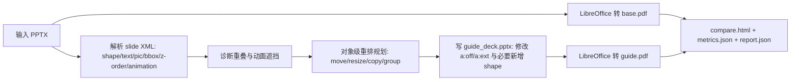

# Object-Level Reflow Overhaul Implementation Plan

> **For agentic workers:** REQUIRED SUB-SKILL: Use `superpowers:executing-plans` to implement this plan task-by-task. Steps use checkbox (`- [ ]`) syntax for tracking.

**Goal:** 大修当前项目，把 `guide.pdf` 从“侧栏解释”改成“PPTX 对象级微调重排后再转 PDF”，让主体页面本身清楚可读。

**Architecture:** `base.pdf` 继续由 LibreOffice 原生转换生成，作为普通 PDF 对照；`guide.pdf` 改由 `guide_deck.pptx` 转换生成，`guide_deck.pptx` 在原 PPTX 基础上移动、缩放、分组和必要时复制具体 shape。PDF 层只做对比页、指标、少量后验标注，不再作为主体重排引擎。

**Tech Stack:** Python 标准库 ZIP/XML、OOXML、LibreOffice headless、PyMuPDF 仅用于渲染检查和对比，不用于主重排。

---

## 路线判定

| 旧路线 | 结论 |
|---|---|
| `pdf_micro_reflow.py` 在原 PDF 右侧加扩展栏 | 保留为实验/旁注能力，不作为主线 |
| 原 PDF 主体不动 | 失效；截图显示主体仍然文字、公式、单位互相压住 |
| 只复制遮挡前后局部 | 不够；用户要的是主体内容可读化 |
| PDF 层承担重排 | 方向不稳；PDF 缺少 PPT 对象语义，不能可靠移动具体文本、公式、图片 |

## 新主线

## 核心验收标准

| 验收点 | 标准 |
|---|---|
| 原画面保留 | 背景、标题、主要语义区、图片风格保持原 PPT 观感，不整页重画 |
| 主体变清楚 | `test.pptx` 第 2 页中正文、公式、单位行不再互相覆盖 |
| 动画关系可见 | 被遮挡对象通过位置调整、轻量编号或流程线表达先后关系 |
| 页数控制 | 默认仍一页对应一页；只有超出同页可读容量才生成局部展开页 |
| 可解释 | 每个对象移动都有原因：遮挡解除、阅读顺序、空白区利用、层级关系 |
| 可回归 | 视觉检测不只看是否产出 PDF，还要检查对象重叠率下降 |

## 阶段 0：止损和清线

- [ ] 把 `pdf_micro_reflow.py` 从主流程移除，只保留为 `sidecar_evidence` 实验能力。
- [ ] `layout_decider.py` 中复杂页策略从 `pdf_micro_reflow` 改为 `object_reflow`。
- [ ] `augment_plan.json` 中新增 `object_reflow` 字段，废弃主线 `micro_reflow`。
- [ ] 文档标明旧 PDF 侧栏路线失效，避免后续继续沿错路修补。

## 阶段 1：OOXML 对象操作底座

- [ ] 新建 `app/backend/ooxml_slide_editor.py`。
- [ ] 实现读取 slide XML 的 shape 列表，保留 `id/name/type/text/bbox/z_order/xml_path`。
- [ ] 实现 `move_shape(slide_xml, shape_id, x, y)`，只修改该 shape 的 `a:off`。
- [ ] 实现 `resize_shape(slide_xml, shape_id, w, h)`，只修改该 shape 的 `a:ext`。
- [ ] 实现 `clone_shape(slide_xml, shape_id, new_id, new_name, x, y, w, h)`，用于把遮挡前对象复制到空白区。
- [ ] 写单测：移动 shape 后，原文本和样式还在，只有坐标变化。

## 阶段 2：重叠诊断从“报告”升级为“可修复图”

- [ ] 新建 `app/backend/reflow_diagnostics.py`。
- [ ] 输入 `analysis.json` 的 `object_boxes/text_objects/animation_steps`。
- [ ] 输出 `overlap_edges`：包含 `front_id/back_id/overlap_area/overlap_ratio/reason`。
- [ ] 对文字对象增加严重度：同一水平带、面积重叠、文本长度高、动画目标遮挡前序对象。
- [ ] 写单测覆盖 `test.pptx` 第 2 页：`2/3/1048/19/20` 必须进入重排候选。

## 阶段 3：对象级重排规划器

- [ ] 新建 `app/backend/object_reflow_planner.py`。
- [ ] 策略顺序固定为：先移动浮动公式/图片，再压缩或下移说明文字，再整理单位行，最后补流程标记。
- [ ] 使用原页空白区：右侧、下方、左侧、顶部；但必须先判断是否会压住已有对象。
- [ ] 对 `test.pptx` 第 2 页采用明确规则：公式对象移到正文右侧空白或下方空白；单位行下移并分行；正文段落避开公式区域。
- [ ] 输出 `object_reflow.operations`，每条包含 `op/type/id/from/to/reason`。
- [ ] 写单测：规划后模拟 bbox 的最大重叠率显著下降。

## 阶段 4：生成 `guide_deck.pptx`

- [ ] 在 `pdf_augmenter.py` 中新增 `object_reflow` 分支，调用 OOXML editor 改原 slide。
- [ ] 保留原 slide 的 theme、layout、图片、字体、形状样式。
- [ ] 对移动过的对象添加非常轻的序号/箭头，不盖住正文。
- [ ] 生成 `guide_deck.pptx` 后由 LibreOffice 转 `guide.pdf`。
- [ ] 写端到端测试：`test.pptx` 生成的 `guide_deck.pptx` 中目标 shape 坐标确实改变。

## 阶段 5：视觉验收和指标

- [ ] 新建或扩展 `visual_reflow_checker.py`。
- [ ] 渲染 `base.pdf` 和 `guide.pdf` 为 PNG，保存到 `.tmp_runs`。
- [ ] 检查 `object_reflow.operations` 数量、重叠率变化、页数变化、文件产出。
- [ ] 人眼抽查 `test.pptx` 两页，特别是第 2 页主体区是否真正变清楚。
- [ ] `metrics.json` 增加 `object_reflow_page_count`、`resolved_overlap_count`、`remaining_overlap_count`。

## 阶段 6：大课件回归

- [ ] 先只对 `test.pptx` 和 `course_animation_occlusion.pptx` 开启对象级重排。
- [ ] 42 页 Review 课件默认只对高置信页面启用，低置信页面保留原生页并写入报告。
- [ ] 每轮修改后跑：单测、py_compile、node check、`test.pptx` CLI、Review 抽样。
- [ ] 完成后再更新 `compare.html`，展示对象被移动前后差异。

## 不做

| 不做项 | 原因 |
|---|---|
| PDF 层直接移动文字 | PDF 缺少可靠 PPT 对象语义 |
| 整页 HTML/PDF 重画 | 会丢失 PPT 原始观感 |
| 对所有 PPT 泛化承诺 | 首版先把 `test.pptx` 这类典型遮挡动画页做扎实 |
| 继续扩大右侧说明栏 | 已证明不能解决主体不可读 |
