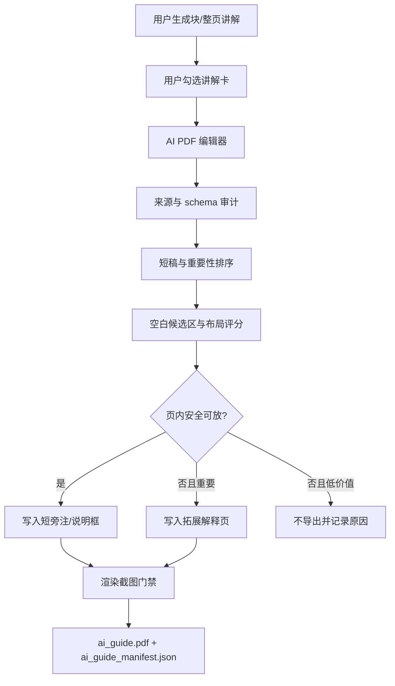

# Agentic AI PDF Editor Implementation Plan

> **For agentic workers:** REQUIRED SUB-SKILL: Use `superpowers:executing-plans` to implement this plan task-by-task. The current repository rule forbids creating a new branch or worktree without explicit user approval, so execution must stay in the current workspace unless the user later authorizes isolation. Steps use checkbox (`- [ ]`) syntax for tracking.

**Goal:** Build an Agent-style AI PDF editor: the user selects explanation cards, the AI extracts only the high-value review snippets and proposes how to integrate them into `ai_guide.pdf`.

**Architecture:** Keep `base.pdf` and `guide.pdf` unchanged. Add a new AI editing stage between explanation generation and PDF export; this stage returns short snippets, importance decisions, and layout intent. The final placement is still decided by deterministic layout scoring and visual gates, not by free-form model coordinates.

**Tech Stack:** Python backend, existing OpenAI-compatible provider, PyMuPDF, existing `knowledge_blocks.json`, `guide_preview_manifest.json`, frontend state in `app/frontend/app.js`, existing AI export endpoint.

---

## Route Contract

| Rule | Decision |
|---|---|
| User role | User selects explanation cards worth considering, not final text blocks. |
| AI role | AI acts as editor: choose, compress, rank, and suggest layout intent. |
| System role | System validates sources, enforces length limits, scores safe positions, renders PDF, and runs visual checks. |
| Output target | Only `ai_guide.pdf` changes. `base.pdf` remains original comparison output; `guide.pdf` remains the stable learning baseline. |
| Failure behavior | Invalid schema, invalid source refs, over-limit text, or unsafe placement must fail visibly or fall back to extension pages; do not silently stuff text into the page. |
| Non-goals | Do not export full AI chat text. Do not let the model invent coordinates. Do not replace `guide.pdf`. Do not show internal `source_refs` in user-facing PDF text. |

## End-to-End Flow

## Data Contract

| Field | Type | Rule |
|---|---|---|
| `card_id` | string | Frontend stable key: block/profile or page/profile. |
| `target_kind` | string | `block` or `page`. |
| `target_id` | string | Block id or `page_<number>`. |
| `prompt_profile` | string | Must match the explanation card version. |
| `include_in_pdf` | bool | AI recommendation after user selected the card. |
| `priority` | int | 1 is highest; used when page space is limited. |
| `pdf_title` | string | Short user-facing title, no internal refs. |
| `pdf_snippet` | string | 40-120 Chinese chars preferred; hard max enforced by backend. |
| `importance_reason` | string | Why this snippet helps review. |
| `drop_reason` | string | Required when `include_in_pdf=false`. |
| `layout_intent` | string | `blank_note`, `margin_note`, `callout`, `extension_panel`, or `drop`. |
| `anchor_block_id` | string | Closest knowledge block for placement. |
| `source_refs` | list | Internal audit only; never rendered as user text. |

## Placement Policy

| Priority | Mode | Use When | Gate |
|---|---|---|---|
| 1 | `blank_note` | Nearby safe blank area can hold the snippet. | No overlap with text, formula, image, media grid, or title. |
| 2 | `margin_note` | Page has stable side or bottom margin. | Must stay visually attached to selected block. |
| 3 | `callout` | Snippet explains a formula, diagram, or animation relationship. | Arrow/connector must stop outside target bbox with safety distance. |
| 4 | `extension_panel` | Snippet is important but page has no safe space. | Insert after source page; keep original page unchanged. |
| 5 | `drop` | Snippet repeats original text or adds low review value. | Manifest records reason; PDF does not include it. |

## Task 1: Backend AI Editing Contract

**Files:**
- Create: `app/backend/ai_pdf_editor.py`
- Modify: `app/backend/ai_explainer.py`
- Test: `app/tests/test_v6_ai_pdf_editor.py`

- [ ] Add a failing test that sends two selected explanation cards and expects one compact PDF snippet plus one dropped item with a reason.
- [ ] Add a failing test that rejects editor output when `pdf_snippet` exceeds the configured hard limit.
- [ ] Implement `edit_explanations_for_pdf(...)` to call the existing provider with a strict JSON schema when supported.
- [ ] Normalize third-party OpenAI-compatible responses the same way existing explanation code does: top-level object required, array fields normalized, source refs audited.
- [ ] Run `python -m unittest app.tests.test_v6_ai_pdf_editor`.

## Task 2: Source Audit And Length Gates

**Files:**
- Modify: `app/backend/ai_pdf_editor.py`
- Modify: `app/backend/ai_audit.py`
- Test: `app/tests/test_v6_ai_pdf_editor.py`

- [ ] Add a test that rejects a snippet whose `source_refs` do not belong to the selected card's block or page.
- [ ] Add a test that rejects rendered user text containing internal short refs like `slide_text@p13#18`.
- [ ] Add a test that enforces per-page budgets: default max 3 snippets and max 250 Chinese chars per page.
- [ ] Implement audit helpers that return clear Chinese errors rather than raw provider exceptions.
- [ ] Run `python -m unittest app.tests.test_v6_ai_pdf_editor app.tests.test_v4_ai_security`.

## Task 3: Blank-Area Layout Planner

**Files:**
- Create: `app/backend/ai_pdf_layout.py`
- Modify: `app/backend/guide_preview.py` if current manifests lack enough page geometry.
- Test: `app/tests/test_v6_ai_pdf_layout.py`

- [ ] Add a test that places a short snippet into a safe blank region near the selected block.
- [ ] Add a test that refuses a candidate overlapping title/body/formula/image/media keyframes.
- [ ] Add a test that sends an important but unplaceable snippet to `extension_panel`.
- [ ] Implement deterministic candidate generation: nearby blank area, margin, callout, then extension panel.
- [ ] Run `python -m unittest app.tests.test_v6_ai_pdf_layout`.

## Task 4: PDF Renderer Integration

**Files:**
- Modify: `app/backend/ai_pdf_exporter.py`
- Test: `app/tests/test_v6_ai_pdf_exporter.py`

- [ ] Add a test that writes a `blank_note` snippet into the copied source page without modifying `guide.pdf`.
- [ ] Add a test that writes `extension_panel` content after the source page when page placement is unsafe.
- [ ] Add a test that `ai_guide_manifest.json` records layout mode, source page, output page, anchor id, and dropped reasons.
- [ ] Implement rendering for compact note boxes with conservative font size and no nested cards.
- [ ] Run `python -m unittest app.tests.test_v6_ai_pdf_exporter app.tests.test_v5_ai_pdf_exporter`.

## Task 5: Frontend Agent Workflow

**Files:**
- Modify: `app/frontend/app.js`
- Modify: `app/frontend/styles.css`
- Test: existing frontend JS tests or add focused tests under `app/tests/test_v6_frontend_ai_pdf_editor.py`

- [ ] Add selected-card state separate from selected knowledge-block state.
- [ ] Add an “AI 整理进 PDF” action that sends selected cards to the backend editor.
- [ ] Show AI decisions on each card: include/drop, short snippet, reason, and layout intent.
- [ ] Let the user override include/drop before final export.
- [ ] Keep full explanation visible in Web, but export only the edited snippets.
- [ ] Run `node --check app/frontend/app.js` and the focused frontend test.

## Task 6: Server Endpoints

**Files:**
- Modify: `app/backend/server.py`
- Test: `app/tests/test_v6_ai_pdf_editor_endpoint.py`

- [ ] Add `/api/ai/edit-pdf` accepting `job_id`, selected explanation cards, and current prompt profile metadata.
- [ ] Keep `/api/ai/export-guide` free of API key fields; it should consume accepted editor decisions, not raw long explanations.
- [ ] Reject unknown job ids, unknown block ids, missing source refs, and cards that do not match the current `knowledge_blocks.json`.
- [ ] Run `python -m unittest app.tests.test_v6_ai_pdf_editor_endpoint app.tests.test_v5_ai_export_endpoint`.

## Task 7: Visual And Product Gates

**Files:**
- Modify: `app/backend/render_visual_check.py` if needed for AI overlay pages.
- Modify: `app/backend/server.py` to include gate result in export response.
- Test: focused visual smoke test if existing render helpers support it.

- [ ] Render source pages touched by AI notes to PNG.
- [ ] Fail export if note boxes overlap protected regions or text is clipped.
- [ ] Keep extension pages as the safe fallback for important snippets.
- [ ] Run `python -m unittest discover app\tests`.
- [ ] Restart the 8765 service and convert `app/samples/test.pptx`; generate selected explanations; export `ai_guide.pdf`; inspect screenshots.

## Milestones

| Milestone | Scope | Pass Condition |
|---|---|---|
| M1 Editor only | AI returns include/drop/snippet/layout intent. | Unit tests prove schema, source audit, and length budgets. |
| M2 Export extension-safe | Edited snippets export to after-page panels only. | Existing export flow remains stable and concise. |
| M3 Page blank notes | Safe snippets enter blank page areas. | Screenshot gate proves no original content is covered. |
| M4 Agent UX | User sees AI decision, can override, then exports. | Workflow feels like an editing agent, not a raw chat dump. |

## Self-Review

| Check | Result |
|---|---|
| Route alignment | Keeps `guide.pdf` stable and creates separate `ai_guide.pdf`. |
| Agent identity | AI makes editorial decisions and layout suggestions, while deterministic code owns final placement. |
| Information density | Per-card and per-page budgets prevent PDF text flooding. |
| Safety | API key stays out of export; source refs stay internal; invalid AI output fails loudly. |
| Visual risk | Page integration starts after extension-safe path and requires screenshot gates. |
